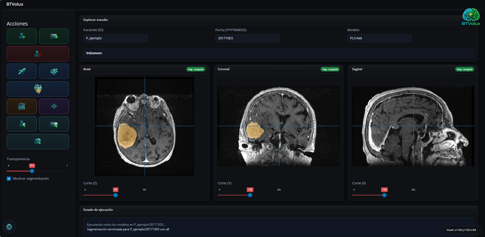
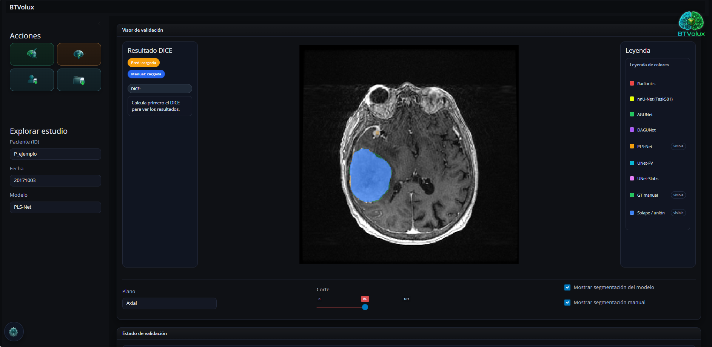
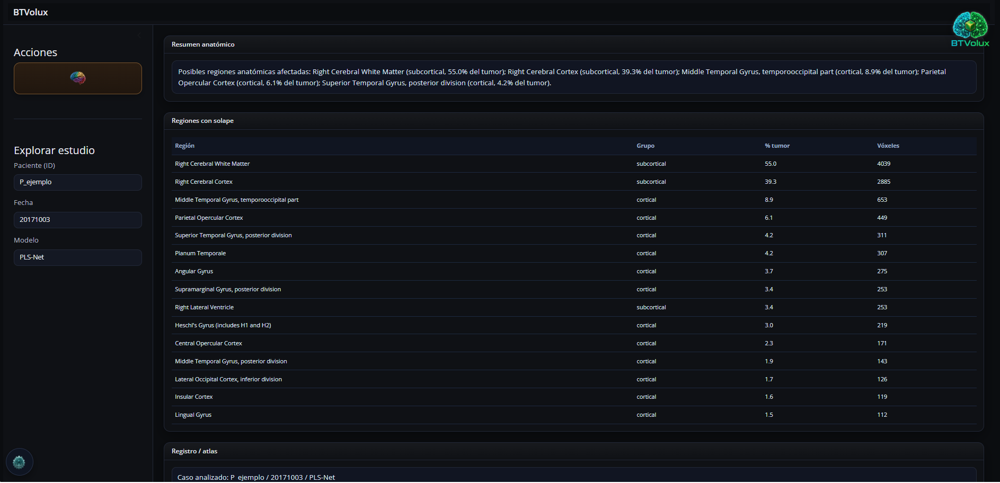

<p align="center">
  
</p>

<h1 align="center">BTVolux</h1>

# BTVolux

BTVolux es una aplicación local para la visualización, segmentación automática, validación y cálculo volumétrico de meningiomas en imágenes de resonancia magnética.

La aplicación permite importar estudios DICOM, convertirlos a NIfTI, ejecutar varios modelos de segmentación, visualizar las máscaras resultantes, calcular volumen tumoral en mL y validar las segmentaciones frente a una referencia manual mediante el coeficiente DICE.

---

## Funcionalidades principales

- Importación de estudios DICOM.
- Validación básica de secuencias T1 con contraste/postcontraste.
- Conversión DICOM a NIfTI.
- Organización por paciente y fecha de estudio.
- Visualización multiplanar:
- Superposición de segmentaciones sobre la RM.
- Ejecución de modelos automáticos:
- Mapa de consenso mediante media ponderada.
- Cálculo de volumen tumoral en mL.
- Carga de segmentación manual.
- Cálculo de DICE frente a segmentación manual.
- Exportación de resultados a CSV.
- Análisis anatómico exploratorio mediante atlas Harvard-Oxford.

---

## Estructura del proyecto

```text
BTVolux/
├── app.py
├── config.py
├── pipeline.py
├── preprocessing.py
├── segmentation.py
├── radionics.py
├── calcular_volumen.py
├── calcular_dice.py
├── atlas_utils.py
├── requirements.txt
├── README.md
├── app_data/
│   ├── config/
│   │   └── storage_settings.json
│   └── images/

├── modelos/
│   └── README_MODELOS.md
└── runtime/
    ├── env_app/
    ├── env_nnunet/
    ├── env_agunet/
    └── env_plsnet/
```

En el repositorio GitHub no se incluyen datos clínicos, pesos de modelos pesados ni entornos `runtime/`.

---

## Estructura esperada de pacientes

BTVolux trabaja con una estructura por paciente y por estudio:

```text
Pacientes_nifti/
└── <PACIENTE_ID>/
    └── <YYYYMMDD>/
        ├── dicom/
        ├── nifti/
        │   └── <PACIENTE_ID>_0000.nii.gz
        ├── radionics/
        ├── nnunet/
        ├── agunet/
        ├── dagunet/
        ├── pls-net/
        ├── unet-fv/
        ├── unet-slabs/
        ├── media_ponderada/
        ├── manual/
        └── tmp/
```

---

## Configuración de rutas

Las rutas principales se definen en:

```text
config.py
```

y pueden guardarse en:

```text
app_data/config/storage_settings.json
```

Ejemplo recomendado para uso portable:

```json
{
  "pacientes_nifti_dir": "Pacientes_nifti",
  "results_dir": "app_data/results"
}
```

Si las rutas son relativas, BTVolux las interpreta respecto a la carpeta raíz de la aplicación.

---

## Ejecución en desarrollo

Instalar dependencias principales:

```bash
pip install -r requirements.txt
```

Ejecutar la app:

```bash
python -m shiny run app.py --host 127.0.0.1 --port 8000
```

La aplicación se abrirá en el navegador local.

---

## Ejecución portable

La versión portable utiliza entornos empaquetados en la carpeta:

```text
runtime/
```

Estructura esperada:

```text
runtime/
├── env_app/
├── env_nnunet/
├── env_agunet/
└── env_plsnet/
```

### Primera ejecución

Tras descomprimir la aplicación en un ordenador nuevo, ejecutar una vez:

```bat
setup_primer_arranque.bat
```

Este script ejecuta `conda-unpack` dentro de los entornos portables.

### Uso habitual

Después de la primera configuración, iniciar la aplicación con:

```bat
BTVolux.exe
```

o, si se prefiere usar el script por lotes:

```bat
launch.bat
```

---

## Interfaz

### Segmentación


### Validación


### Atlas anatómico


---

## Modelos

Los modelos no se incluyen en este repositorio.

Consulta:

```text
modelos/README_MODELOS.md
```

para conocer:

- qué modelos usa BTVolux;
- de dónde proceden;
- qué ruta espera la aplicación;
- qué entorno portable ejecuta cada modelo.

---


## Protección de datos

BTVolux está diseñado para trabajar con estudios médicos. Cualquier dato clínico o imagen de paciente debe almacenarse fuera del repositorio y utilizarse únicamente si está anonimizado y autorizado.

---

## Autor

Pablo Fuentes de Mateo  
Trabajo de Fin de Grado en Ingeniería de la Salud  
Universidad de Burgos